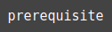
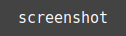
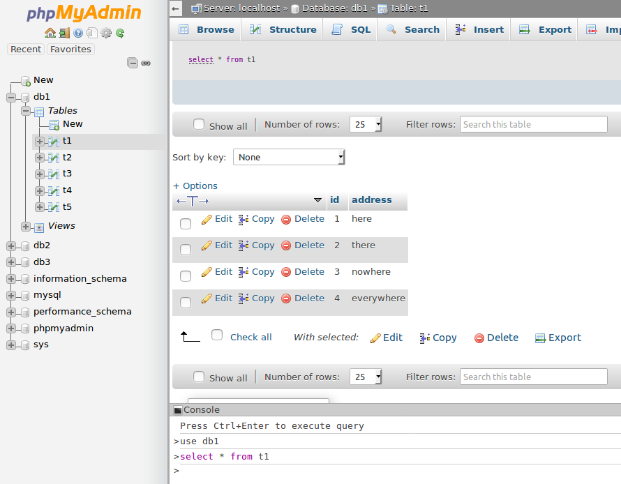
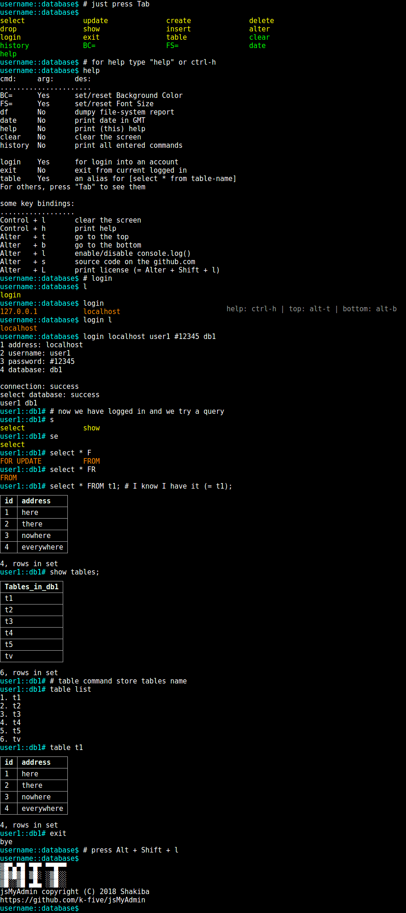

 

  
  
  
  
  
  

 
 

      
  <strong>A simple web-app that with the help of:</strong>  
    
    
    
    
    
    
      
  <strong>will try to help you, so you</strong> 
  <strong>can have a better experience</strong> 
  <strong>when you want to use a console-like</strong> 
  <strong>app to deal with MySql or other databases.</strong> 

 
 
<h1 id="prerequisite" align="center">prerequisite</h1>

  &#9898; <a href="https://k-five.github.io/jsMyAdmin/">demo</a>
  &#9899; prerequisite
  &#9898; <a href="#commands">commands</a>
  &#9898; <a href="#screenshot">screenshot</a>
  &#9898; <a href="#bottom">bottom</a>
  &#9898; <a href="#top">top</a>

 

 - A font of `monospace` family. Default is: `'DejaVu Sans Mono', 'Source code variable', monospace`  
   - these two font are added to the repository, so you install them.  
 - Modern Browsers which can support **CSS Animation**.  

 
 
<h1 id="commands" align="center">commands</h1>

  &#9898; <a href="https://k-five.github.io/jsMyAdmin/">demo</a>
  &#9898; <a href="#prerequisite">prerequisite</a>
  &#9899; commands
  &#9898; <a href="#screenshot">screenshot</a>
  &#9898; <a href="#bottom">bottom</a>
  &#9898; <a href="#top">top</a>

 

<table>
    <tr>
      <th>Name</th>
      <th>Argument</th>
      <th>Description</th>
    </tr>
    <tr>
      <td>df</td>
      <td>No</td>
      <td>dummy file-system report</td>
    </tr>
    <tr>
      <td>date</td>
      <td>No</td>
      <td>print date in GMT</td>
    </tr>
    <tr>
      <td>help</td>
      <td>No</td>
      <td>print (this) help</td>
    </tr>
    <tr>
      <td>clear</td>
      <td>No</td>
      <td>clear the screen</td>
    </tr>
    <tr>
      <td>history</td>
      <td>No</td>
      <td>print all entered commands</td>
    </tr>
    <tr>
      <td>table</td>
      <td>Yes: table-name</td>
      <td>a shortcut for `select * from "table-name"`</td>
    </tr>
    <tr>
      <td>BC=</td>
      <td>Yes: hex-color</td>
      <td>set/reset background color</td>
    </tr>
    <tr>
      <td>FS=</td>
      <td>Yes: a number</td>
      <td>set/reset font size</td>
    </tr>
</table>
 

<h4>keystrokes:</h4>

 - Tab completion  
 - Cursor movement  
   - Home  
   - End  
   - Left-arrow  
   - Right-arrow  
 - History Navigation  
   - Up-arrow  
   - Down-arrow  
 - Modify line  
   - Backspace  
   - Delete  
 - Special Key  
   - Alt  
   - Ctrl  
   - Shift  

 
 
<h1 id="screenshot" align="center">screenshot</h1>

  &#9898; <a href="https://k-five.github.io/jsMyAdmin/">demo</a>
  &#9898; <a href="#prerequisite">prerequisite</a>
  &#9898; <a href="#commands">commands</a>
  &#9899; screenshot
  &#9898; <a href="#bottom">bottom</a>
  &#9898; <a href="#top">top</a>

 

Here is **phpMyAdmin** screenshot for a query like: `select * from "table-name"`

 

 

Some problems with **phpMyAdmin** (for me):
 - command is at the bottom and result at the top whereas the opposite is the convention
   - in a console or Terminal or Emulator we type from left-to-right and we will see the result from top-to-bottom
   - after typing commands, output will be appeared/displayed below the commands not above it
 - a lot of buttons and distractions around the query result which makes it hard to find and read data

I think they could make it (their console) much much better than it is now, anyway, here is my view:

 

 
 
<h1 id="license" align="center">license</h1>

  &#9898; <a href="https://k-five.github.io/jsMyAdmin/">demo</a>
  &#9898; <a href="#prerequisite">prerequisite</a>
  &#9898; <a href="#commands">commands</a>
  &#9898; <a href="#screenshot">screenshot</a>
  &#9899; bottom
  &#9898; <a href="#top">top</a>

  jsMyAdmin copyright &copy; 2018 Shakiba
   
   
  ▒█▀▄▀█ ▀█▀ ▀▀█▀▀ 
  ▒█▒█▒█ ▒█░ ░▒█░░ 
  ▒█░░▒█ ▄█▄ ░▒█░░ 

